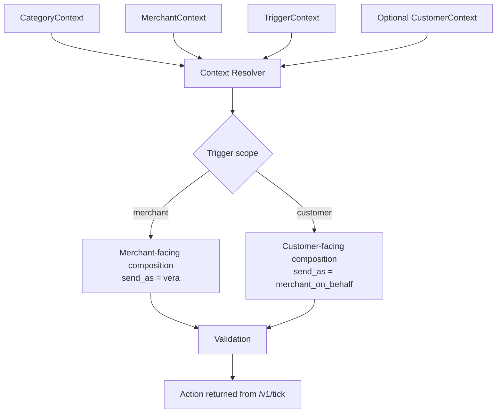
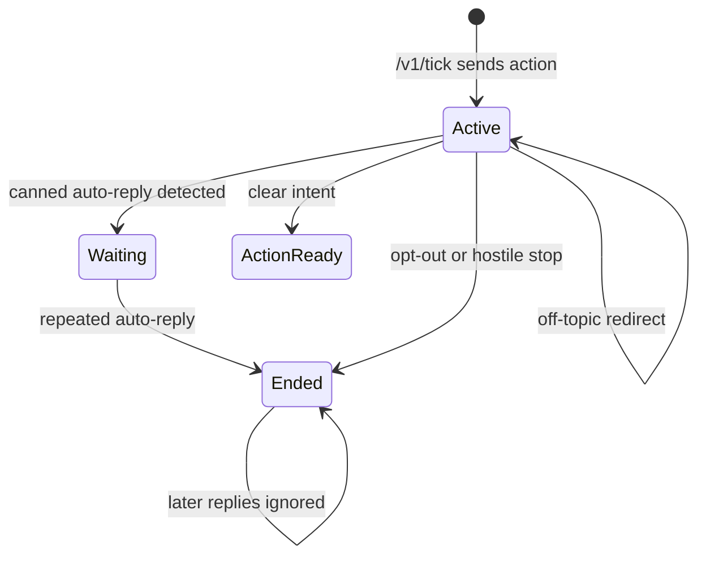
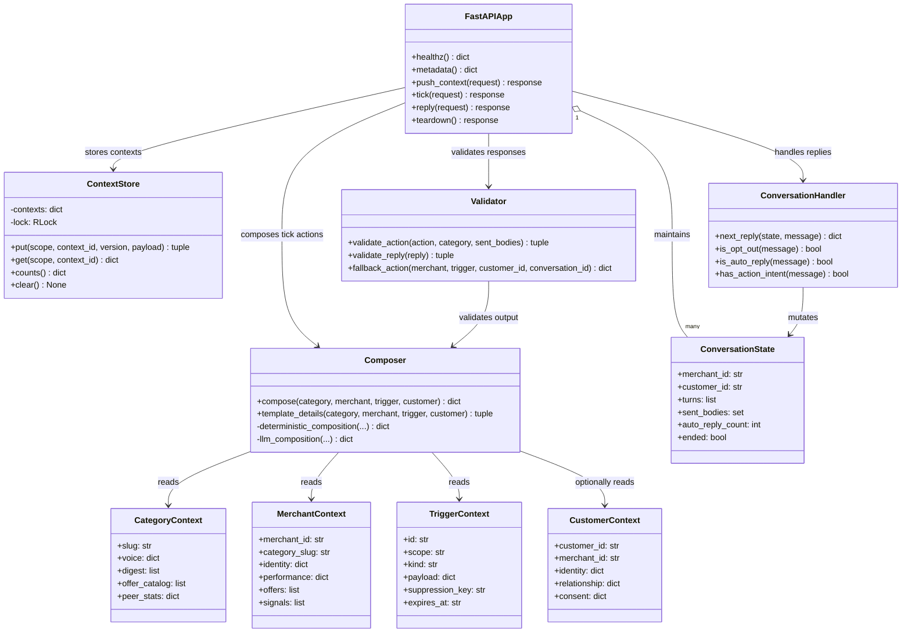
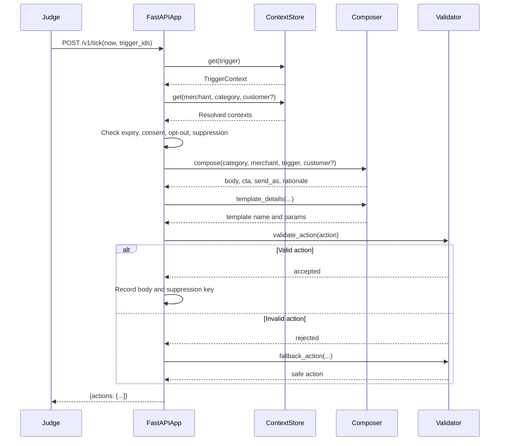

# Vera Engagement Bot Architecture

## System Architecture

```mermaid
flowchart LR
    J[Magicpin Judge Harness]

    subgraph BOT[Candidate Bot - FastAPI]
        API[HTTP API\n/v1/*]
        STORE[(ContextStore\nversioned in-memory state)]
        ROUTER[Tick Router]
        RESOLVE[Context Resolver]
        COMP[Engagement Composer]
        DET[Deterministic Composer]
        LLM[Optional LLM Wording]
        VALIDATE[Action Validator]
        SUPPRESS[Suppression + Opt-out State]
        CONV[Conversation Handler]
        REPLYVAL[Reply Validator]
    end

    DATA[Category / Merchant / Customer / Trigger JSON]
    SCORE[Judge LLM Scoring]

    J -->|POST /v1/context| API
    API --> STORE
    DATA -. local seed / expanded data .-> STORE

    J -->|POST /v1/tick| API
    API --> ROUTER
    ROUTER --> RESOLVE
    RESOLVE --> STORE
    RESOLVE --> SUPPRESS
    RESOLVE --> COMP

    COMP --> DET
    DET -. fallback always available .-> COMP
    COMP -->|optional configured call| LLM
    LLM -->|valid grounded JSON| COMP
    LLM -. timeout / invalid / hallucinated output .-> DET

    COMP --> VALIDATE
    VALIDATE -->|valid action| SUPPRESS
    VALIDATE -->|invalid action| DET
    SUPPRESS -->|actions[]| API
    API -->|JSON response| J

    J -->|POST /v1/reply| API
    API --> CONV
    CONV --> REPLYVAL
    REPLYVAL -->|send / wait / end| API
    API -->|JSON response| J

    J -->|messages for scoring| SCORE
```

## Context Flow



## Conversation Flow



## UML Class Diagram



## UML Tick Sequence



## Endpoint Ownership

| Endpoint | Owner | Main responsibility |
|---|---|---|
| `GET /v1/healthz` | `bot.py` | Liveness and context counts |
| `GET /v1/metadata` | `bot.py` | Bot identity and active composition mode |
| `POST /v1/context` | `bot.py` + `context_store.py` | Versioned context ingestion |
| `POST /v1/tick` | `bot.py` + `composer.py` | Trigger resolution and proactive actions |
| `POST /v1/reply` | `bot.py` + `conversation.py` | Multi-turn conversation response |
| `POST /v1/teardown` | `bot.py` | Local/test state cleanup |

## Composition Decision

The bot uses deterministic composition by default:

```text
contexts -> trigger-specific rules -> validation -> action
```

When enabled, the optional LLM is used only for wording:

```text
contexts -> deterministic baseline -> LLM wording -> grounding validation
                                             |
                         invalid / timeout --+--> deterministic baseline
```

The LLM cannot change:

- Merchant or customer identity
- Trigger ID
- Suppression key
- Sender type
- Consent decision
- Expiry decision
- Conversation termination rules
