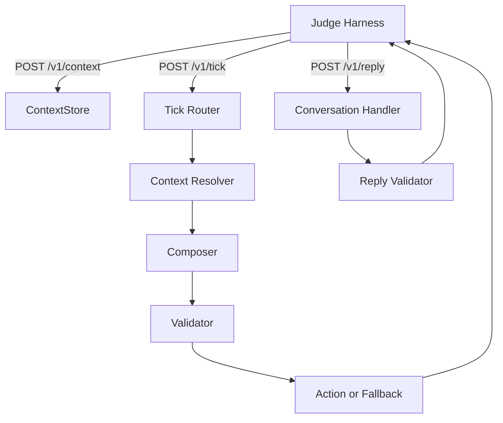
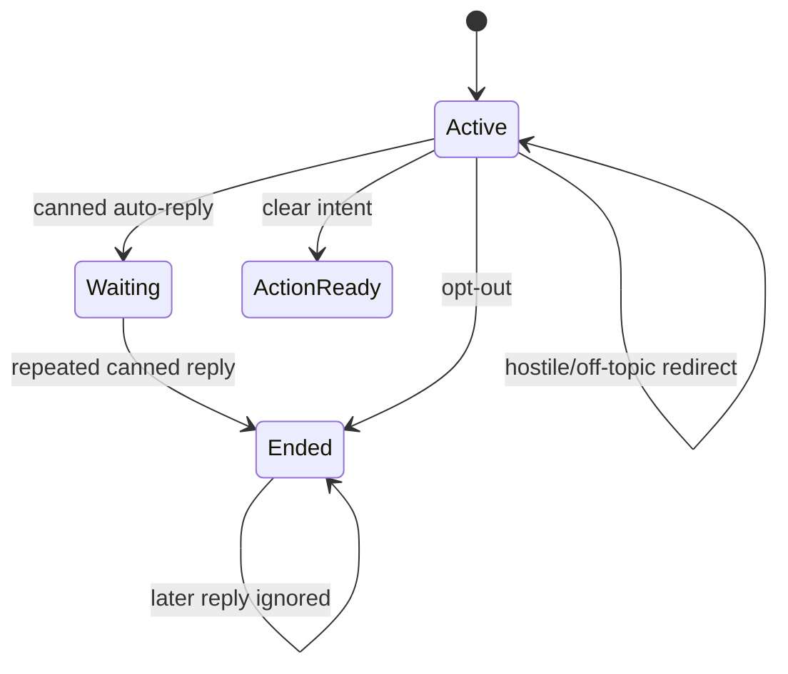

# Vera Engagement Bot - Low-Level Design

## 1. Purpose

The Vera Engagement Bot is a FastAPI service for the magicpin AI Challenge. It receives versioned category, merchant, customer, and trigger contexts, decides whether to initiate a conversation, composes a WhatsApp message, validates it, and handles simulated replies.

The primary composition contract is:

```text
category + merchant + trigger + optional customer -> message action
```

The implementation supports deterministic composition by default and optional LLM-assisted wording with a deterministic fallback.

## 2. Goals and Non-Goals

### Goals

- Accept incremental context updates during a running judge session.
- Compose grounded merchant-facing and customer-facing messages.
- Avoid fabricated prices, dates, slots, metrics, sources, or offers.
- Suppress duplicate and expired sends.
- Respect customer consent and merchant opt-outs.
- Handle auto-replies, intent transitions, hostile messages, and normal replies.
- Return valid JSON within the judge timeout.
- Generate the offline `submission.jsonl` using the same composer as the API.

### Non-goals

- Persistent production storage.
- Real WhatsApp delivery.
- External merchant, CRM, research, or scheduling integrations.
- MCP, Redis, Aryan, or existing production Vera integrations.
- Fully autonomous business actions outside the challenge response contract.

## 3. High-Level Architecture



### Runtime modules

| Module | Responsibility |
|---|---|
| `bot.py` | FastAPI application, request models, endpoint orchestration, suppression and opt-out state |
| `context_store.py` | Thread-safe in-memory versioned context storage |
| `composer.py` | Deterministic trigger-specific composition, template metadata, optional LLM wording |
| `conversation.py` | Reply classification and conversation state transitions |
| `validation.py` | Action/reply validation, taboo checks, duplicate checks, safe fallbacks |
| `generate_submission.py` | Offline JSONL generation using the shared composer |
| `dataset/` | Seed contexts and deterministic expanded data |
| `tests/` | Unit and API contract tests |
| `judge_simulator.py` | Local judge harness and LLM scoring client |

## 4. State Model

### 4.1 Context store

Contexts are keyed by:

```python
(scope, context_id)
```

Each entry contains:

```python
{
    "version": int,
    "payload": dict
}
```

Valid scopes are:

```text
category, merchant, customer, trigger
```

`ContextStore.put()` deep-copies payloads to prevent callers from mutating stored state. A higher version replaces the previous entry atomically under an `RLock`. Same or lower versions are rejected.

### 4.2 Application state

`bot.py` maintains process-local state:

```python
conversations: dict[str, ConversationState]
sent_suppression_keys: set[str]
opted_out_merchants: set[str]
```

A process restart clears all state. This is acceptable for the challenge because the judge keeps the process alive during a run.

### 4.3 Conversation state

```python
@dataclass
class ConversationState:
    merchant_id: str | None
    customer_id: str | None
    turns: list[dict[str, str]]
    sent_bodies: set[str]
    auto_reply_count: int
    ended: bool
```

Conversation IDs generated by `/v1/tick` are stable for a trigger:

```text
conv_{merchant_id}_{trigger_id}
```

## 5. HTTP API Design

### 5.1 `GET /v1/healthz`

Returns liveness and loaded-context counts:

```json
{
  "status": "ok",
  "uptime_seconds": 120,
  "contexts_loaded": {
    "category": 5,
    "merchant": 50,
    "customer": 200,
    "trigger": 100
  }
}
```

### 5.2 `GET /v1/metadata`

Returns bot identity, model mode, approach, version, and submission metadata. If `BOT_LLM_PROVIDER` is disabled, the model is reported as `deterministic-composer-v0`.

### 5.3 `POST /v1/context`

Request fields:

```json
{
  "scope": "category",
  "context_id": "dentists",
  "version": 1,
  "payload": {},
  "delivered_at": "2026-04-26T10:00:00Z"
}
```

Processing:

1. Validate scope and Pydantic field constraints.
2. Store the payload if its version is newer.
3. Return an acknowledgement and UTC timestamp.
4. Return HTTP `400` for invalid scope.
5. Return HTTP `409` for stale or duplicate versions.

### 5.4 `POST /v1/tick`

Request:

```json
{
  "now": "2026-04-26T10:30:00Z",
  "available_triggers": ["trg_001"]
}
```

For each trigger, the router:

1. Loads the trigger context.
2. Skips missing triggers.
3. Skips triggers expired at the supplied simulated time.
4. Checks merchant-level opt-out.
5. Loads the merchant context.
6. Loads the merchant category context.
7. Loads the optional customer context.
8. Checks customer consent for customer-scoped triggers.
9. Checks the trigger suppression key.
10. Creates or reuses conversation state.
11. Calls `compose()` and `template_details()`.
12. Validates the assembled action.
13. Uses a safe fallback if validation fails.
14. Records the body and suppression key.
15. Returns no more than 20 actions.

If no trigger is safe or actionable:

```json
{"actions": []}
```

### 5.5 `POST /v1/reply`

Request fields include conversation ID, merchant/customer IDs, sender role, message, timestamp, and turn number.

The handler returns one of:

```json
{"action": "send", "body": "...", "cta": "open_ended", "rationale": "..."}
```

```json
{"action": "wait", "wait_seconds": 14400, "rationale": "..."}
```

```json
{"action": "end", "rationale": "..."}
```

Invalid reply structures are replaced by a safe five-minute wait response.

### 5.6 `POST /v1/teardown`

Clears context, conversation, suppression, and opt-out state. This endpoint is optional in the challenge brief but useful for local repeatable tests.

## 6. Composition Design

### 6.1 Deterministic path

`_compose_deterministic()` determines whether the message is merchant-facing or customer-facing.

Merchant-facing messages use:

- Owner/business name
- Locality
- Active offers
- Merchant performance and signals where supported
- Category digest items
- Trigger payload

Customer-facing messages use:

- Customer name
- Merchant name
- Customer relationship state
- Consent-compatible trigger
- Due dates, available slots, services, or refill molecules when supplied

### 6.2 Supported trigger families

Merchant-facing examples:

- `research_digest`
- `regulation_change`
- `perf_dip`
- `perf_spike`
- `renewal_due`
- `festival_upcoming`
- `ipl_match_today`
- `review_theme_emerged`
- `milestone_reached`
- `active_planning_intent`
- `seasonal_perf_dip`
- `supply_alert`
- `category_seasonal`
- `gbp_unverified`
- `cde_opportunity`
- `competitor_opened`
- `dormant_with_vera`
- `winback_eligible`
- `curious_ask_due`

Customer-facing examples:

- `recall_due`
- `wedding_package_followup`
- `customer_lapsed_soft`
- `customer_lapsed_hard`
- `trial_followup`
- `chronic_refill_due`
- `appointment_tomorrow`

Unknown kinds receive a minimal grounded fallback rather than an invented trigger-specific claim.

### 6.3 Optional LLM path

The bot can use an LLM only when configured:

```env
BOT_LLM_PROVIDER=gemini
GEMINI_API_KEY=...
BOT_LLM_MODEL=gemini-flash-latest
```

The LLM receives the four contexts and a deterministic fallback. It must return JSON containing:

```json
{
  "body": "...",
  "cta": "open_ended",
  "rationale": "..."
}
```

The LLM output is accepted only when it passes:

- Non-empty body and rationale
- Body length limit
- Valid CTA
- No URL
- No category taboo phrase
- Recipient name present
- At least one supplied context anchor present

Any timeout, provider error, invalid JSON, or failed grounding check must return the deterministic composition.

**Implementation requirement:** `compose()` must call the LLM helper with the deterministic result and return `generated or deterministic`. This preserves service behavior when the provider is unavailable.

### 6.4 Template metadata

`template_details()` maps trigger kinds to first-touch template names and structured parameters. Parameters contain recipient, key fact, date/slot, metric, or CTA information rather than the entire message body.

## 7. Validation and Safety

`validation.py` validates actions for:

- Required fields
- Non-empty body
- Allowed `send_as`: `vera`, `merchant_on_behalf`
- Allowed CTA: `open_ended`, `binary_yes_no`, `none`
- List-shaped template parameters
- Non-empty rationale
- Duplicate body prevention
- Category taboo phrase prevention

The fallback action uses only merchant identity and trigger kind. It is intentionally conservative when the normal composer fails.

## 8. Conversation State Machine



Rules:

- A message containing an opt-out phrase ends the conversation.
- Merchant opt-out is propagated to future merchant triggers.
- The first recognized canned auto-reply produces a four-hour wait.
- A repeated canned auto-reply ends the conversation.
- Clear action phrases such as `yes`, `go ahead`, `send it`, or `let's do it` immediately produce a send action.
- Hostile or off-topic messages receive a polite redirect.
- Ended conversations cannot reopen.
- Previously sent bodies cannot be repeated in the same conversation.

## 9. Consent and Privacy

Customer messages require:

- Customer opt-in not explicitly disabled.
- A non-empty consent scope.
- A trigger-compatible consent scope.

Examples:

| Trigger | Accepted consent scopes |
|---|---|
| `recall_due` | `recall_reminders` |
| `appointment_tomorrow` | `appointment_reminders` |
| `trial_followup` | `program_updates`, `appointment_reminders` |
| `wedding_package_followup` | `appointment_reminders`, `bridal_package_followup` |
| `chronic_refill_due` | `refill_reminders` |
| `customer_lapsed_hard` | `winback_offers`, `promotional_offers` |

The bot does not call external APIs with context data. Logs should not include unnecessary customer payloads. `.env` is ignored and keys must remain outside source control.

## 10. Time and Expiry

All incoming timestamps are parsed as ISO timestamps. Trigger expiration is compared against the `now` value supplied to `/v1/tick`, not the machine clock. The local simulator uses `SIMULATED_NOW` so the April 2026 dataset remains active during local testing.

Malformed expiration timestamps are treated as non-expiring by the current implementation. Production hardening should instead reject or quarantine malformed trigger timestamps.

## 11. Error Handling and Timeouts

- FastAPI/Pydantic rejects malformed request bodies.
- Missing context results in no action rather than a fabricated message.
- Expired, suppressed, opted-out, or non-consented contexts are skipped.
- LLM calls have an 8-second composition timeout.
- LLM errors use deterministic composition.
- Invalid actions use a safe fallback.
- Invalid replies use a five-minute wait.
- The judge’s per-call timeout is 30 seconds; the application should remain well below it.

## 12. Offline Submission Flow

`generate_submission.py` loads:

- Expanded categories
- Expanded merchants
- Expanded customers
- Expanded triggers
- Canonical `test_pairs.json`

For each of the first 30 pairs it calls the same `compose()` function used by the API and writes one JSON object per line to `submission.jsonl`.

Required output fields:

```json
{
  "test_id": "T01",
  "body": "...",
  "cta": "open_ended",
  "send_as": "vera",
  "suppression_key": "...",
  "rationale": "..."
}
```

## 13. Testing Strategy

Run:

```cmd
.venv\Scripts\python.exe -m pytest -q
```

Test categories:

- Context storage isolation and deep-copy behavior
- Same/lower/higher version behavior
- Context counts and teardown
- API health and metadata
- HTTP 400/409 context responses
- Trigger routing
- Expiry and suppression
- Customer consent
- Merchant opt-out propagation
- All seed trigger kinds
- Template parameter structure
- Taboo and duplicate validation
- LLM acceptance and hallucination fallback
- Auto-reply transitions
- Intent transitions
- Ended conversation behavior

Before simulator scoring:

1. Start the bot from the current source.
2. Confirm `/v1/healthz` responds.
3. Confirm `SIMULATED_NOW` is April 2026.
4. Run the simulator warmup or use `/v1/teardown` first.
5. Regenerate `submission.jsonl` after composer changes.
6. Distinguish real LLM scores from fallback heuristic scores.

## 14. Configuration

`.env` contains local configuration. `.env.example` is the shareable template.

Important variables:

```env
BOT_URL=http://localhost:8080
BOT_LLM_PROVIDER=none
BOT_LLM_MODEL=gemini-flash-latest
LLM_PROVIDER=gemini
LLM_MODEL=gemini-3.1-flash-lite
TEST_SCENARIO=phase2_short
SIMULATED_NOW=2026-04-26T10:30:00+00:00
GEMINI_API_KEY=
```

`BOT_LLM_*` controls composition inside the bot. `LLM_*` controls the external judge simulator. These are separate concerns.

## 15. Deployment

Local command:

```cmd
.venv\Scripts\python.exe -m uvicorn bot:app --host 0.0.0.0 --port 8080
```

A hosted deployment must:

- Expose the `/v1/*` routes publicly.
- Bind to the platform-provided port.
- Set environment variables through the host configuration.
- Keep the process alive for the complete test window.
- Pass repeated health probes.
- Avoid multiple workers unless shared state is introduced.

The current in-memory design should run with one worker. Multiple workers would create independent context stores and cause inconsistent judge behavior.

## 16. Known Gaps and Follow-Up Work

1. Correct the optional LLM call path so deterministic fallback is returned whenever generated wording is unavailable.
2. Regenerate `submission.jsonl` after every composer change.
3. Add stronger per-trigger grounding requirements for LLM output; one generic anchor is currently permissive.
4. Improve category-specific voice and merchant-performance fact selection across all trigger branches.
5. Model WhatsApp session-window/template behavior explicitly if the final judge enforces it.
6. Treat malformed expiration timestamps as invalid instead of non-expiring.
7. Add persistent storage only if the deployment platform can restart the process during a judge run.
8. Replace generic reply boilerplate with trigger-aware follow-up artifacts.

## 17. Acceptance Checklist

- [ ] `/v1/healthz` returns status `ok`.
- [ ] `/v1/metadata` returns bot identity.
- [ ] Context version replacement works.
- [ ] Stale context returns HTTP `409`.
- [ ] Invalid scope returns HTTP `400`.
- [ ] Tick skips missing, expired, suppressed, opted-out, and non-consented contexts.
- [ ] Tick returns valid actions or an empty action list.
- [ ] Reply handles opt-out, auto-reply, intent, hostility, and ended conversations.
- [ ] No unsupported facts or taboo phrases appear in outputs.
- [ ] `submission.jsonl` contains 30 valid records.
- [ ] Automated tests pass.
- [ ] Public deployment passes health and metadata checks.
